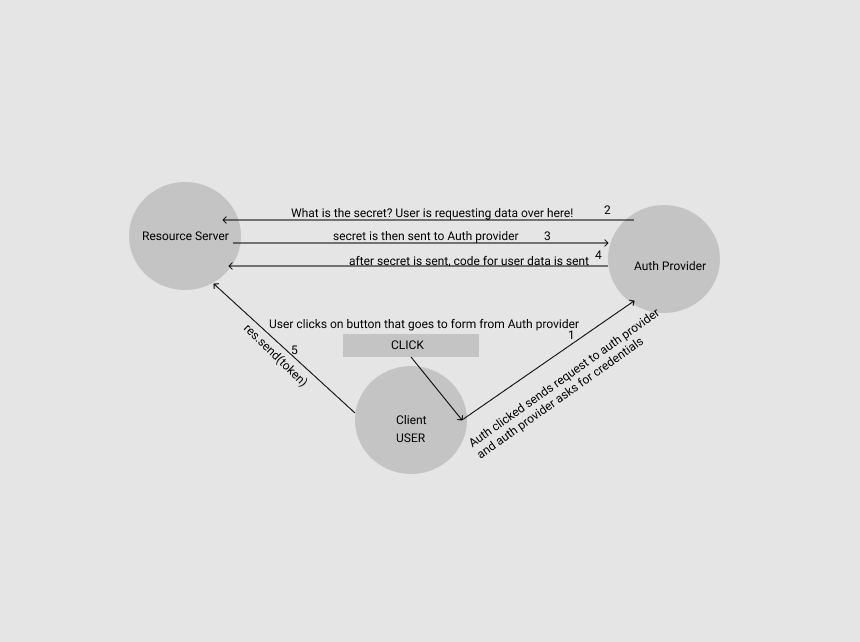

# oAuth
 Using OAuth to manage user credentials instead of managing user names and passwords internally

 **Author: Riva Davidowski**

**An Express/Node.js based server using a custom “authentication” module that is designed to handle user registration and sign in using Basic, Bearer, or OAuth along with a custom “authorization” module. Our group chose to use WordPress as the Auth provider.**

### Installing dependencies:


You will need to install the following on your machine:

- `npm init -y `
- **The entry point for this app is: `index.js`**
- `npm install` for the following:
    - `bcrypt`
    - `dotenv`
    - `cors`
    -  `express`
    -  `superagent`
**Start server:**
   
```
 /* give it a port number and optionally pass a function to call when app
     starts listening on given port*/

const port = process.env.PORT || 3000;
app.listen(port, () => console.log(`Listening on port ${port}`));

```

### env Requirements:

PORT=3001

CLIENT_ID=

CLIENT_SECRET=

REDIRECT_URI=http://localhost:3001/oauth

TOKEN_SERVER_URL=

### UML:


